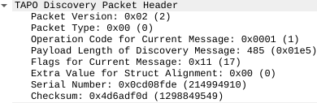

# Tapo_protocol_analysis
(WIP) Wireshark dissector for a proprietary protocol found on TP-Link Tapo cameras, dissecting device discovery packets on ports `UDP/20002` and `UDP/20004`, as well as control and media stream packets on port `TCP/8800` and keep-alive packets on port `TCP/8001`. Tested on TP-Link Tapo C100 IP camera.

Table of Contents
=================
* [Filters](#filters)
* [Device Discovery Packets](#device-discovery-packets)
    * [Header Structure](#header-structure)
    * [Payloads](#payloads)
* [Control and Media Packets](#control-and-media-packets)
    * [Header Structure](#header-structure-1)

# Filters

The following filters are programmed for this Tapo protocol dissector:

|Port|Packet Type|Field Name|Description|
|:--:|:---------:|:---:|:---------:|
|UDP/20002|Device discovery packet|tapo.header|Full header, saved as raw bytes|
|UDP/20002|Device discovery packet|tapo.signature|Signature bytes|
|UDP/20002|Device discovery packet|tapo.payload_length|Payload length|
|UDP/20002|Device discovery packet|tapo.unknown_1|Unknown field number 1|
|UDP/20002|Device discovery packet|tapo.unknown_2|Unknown field number 2|
|UDP/20002|Device discovery packet|tapo.crc32|CRC cheksum|
|UDP/20002|Device discovery packet|tapo.data|JSON payload|
|UDP/20002|Device discovery packet|tapo.binary|Discovery packet with binary data|
|TCP/8800|Contol/media packet|tapo.device_stream_boundary|Device stream boundary|
|TCP/8800|Contol/media packet|tapo.content_type|Content Type|
|TCP/8800|Contol/media packet|tapo.content_length|Content Length|
|TCP/8800|Contol/media packet|tapo.session_id|Session ID|
|TCP/8800|Contol/media packet|tapo.encrypted|Payload encryption flag|
|TCP/8001|Keep-alive packet|tapo.data|JSON payload|

# Device Discovery Packets

Ports `UDP/20002` and `UDP/20004` are used with configuration and cryptography-related information being sent.

## Header Structure

A writeup on [command injection vulnerability within tdpServer daemon that listens on port UDP/200002](https://www.flashback.sh/blog/lao-bomb-tplink-archer-lan-rce), as well as a writeup on [remote code execution (RCE) vulnerability found in the TP-Link AC1750 Smart Wi-Fi router](https://www.synacktiv.com/publications/pwn2own-tokyo-2020-defeating-the-tp-link-ac1750), describe that a device discovery packet has 16 bytes long header with it's fields defined as follows:


The fields are identified as follows:
1. **Byte 1:** Packet version.
2. **Byte 2:** Packet type.
3. **Bytes 3-4:** Packet opcode.
4. **Bytes 5-6:** Packet payload length.
5. **Byte 7:** Packet flags.
6. **Byte 8:** Struct alignment.
7. **Bytes 9-12:** Serial Number.
8. **Bytes 13-16:** Checksum.

Below is the header's representation in Wireshark:




More information about header structure of the tapo device discovery packet can be found [on this Stack Overflow discussion thread](https://stackoverflow.com/questions/62493536/decoding-the-binary-part-of-a-discovery-udp-packet-payload-for-tp-link-tapo-c200).

## Payloads

Observed payloads include:

1. Device configuration messages, some data encrypted with AES key:

```json
{
  "error_code": 0,
  "result": {
    "device_id": "REDACTED",
    "device_name": "Tapo C100",
    "device_type": "SMART.IPCAMERA",
    "device_model": "C100",
    "ip": "REDACTED",
    "mac": "REDACTED",
    "hardware_version": "4.0",
    "firmware_version": "1.1.21 Build 220511 Rel.42882n(4555)",
    "factory_default": false,
    "mgt_encrypt_schm": {
      "is_support_https": true
    },
    "encrypt_info": {
      "sym_schm": "AES",
      "key": "REDACTED",
      "data": "REDACTED"
    }
  }
}
```

2. Public RSA key:

```json
{
  "params": {
    "rsa_key": "-----BEGIN PUBLIC KEY-----\\nMIIBIjANBgkqhkiG9w0BAQEFAAOCAQ8AMIIBCgKCAQEAvzPNrLCSw3Rqf+AKwla2\\nntENZ+P4UUwGDzwvSc5HyJIYkY5+aQ8tpdQAO6NfN1JlVAUm94gxH5cw9s+xGgok\\nusbhFCHvMFp2g0CxvFg1P225+fq8Hmqqm9JN/ZkL2qwR4to6yvn256IqUxzmwKi8\\nFiX60VmAkmeJDOy8XGcN8ch385T9/sX1KyKZNxzX4z5xJEOlwcr5ZdhUeOmB6dbF\\njFF8GliOKSZdE01GVgeZPqJA21/8EQa1yJy8v31o+NNRd3QJaWjIzFqjGs1sl+Zj\\niPggKWcR/LqGt8Dd031velv2gVgmyBIjqi779cxns8IA5zYsvJbkxm0pFr3CU3GZ\\nYQIDAQAB\\n-----END PUBLIC
KEY-----\\n"
  }
}
```

# Control and Media Packets

A proprietary protocol that manages JSON control messages and encrypted media (audio + video) streams runs on port `TCP/8800`.

## Header Structure

Header is formed from the first 28 bytes of a control and media packet. Fields are text based rather that byte-based:

|Field Name|Description|
|:---:|:---------:|
|----device-stream-boundary--|Every control/media packet starts with this text as a start boundary|
|Content-Type: \<type\>|`application/json` for JSON payloads and `video/mp2t` for video stream|
|Content-Length: \<length\>|Length of a single message|
|X-Session-Id: \<id\>|ID of a current session|
|X-If-Encrypt: \<bool\>|Payload encryption flag; 0 - unencrypted, 1 - encrypted|

## Payloads

Payloads of this protocol include JSON-formatted stream information and encrypted video stream with a type of `mp2t`.

1. Request of video stream:

```json
{
  "params": {
    "preview": {
      "audio": [
        "default"
      ],
      "audio_config": {
        "encode_type": "G711alaw",
        "sample_rate": "8"
      },
      "channels": [
        0
      ],
      "deviceId": "REDACTED",
      "resolutions": [
        "HD"
      ],
      "track_id": "REDACTED"
    },
    "method": "get"
  },
  "seq": 1,
  "type": "request"
}
```

2. Response on success:

```json
{
  "type": "response",
  "seq": 1,
  "params": {
    "error_code": 0,
    "session_id": "1"
  }
}
```

3. Channel lens mask info:

```json
{
  "type": "notification",
  "params": {
    "event_type": "channel_lens_mask_info",
    "channels": 0,
    "enabled": "off"
  }
}
```

4. Channel resolution info:
```json
{
  "type": "notification",
  "params": {
    "event_type": "channel_resolution_info",
    "channels": 0,
    "resolution": "1280*720"
  }
}
```
